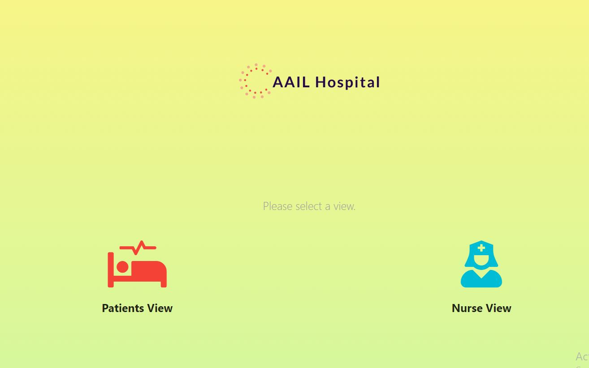
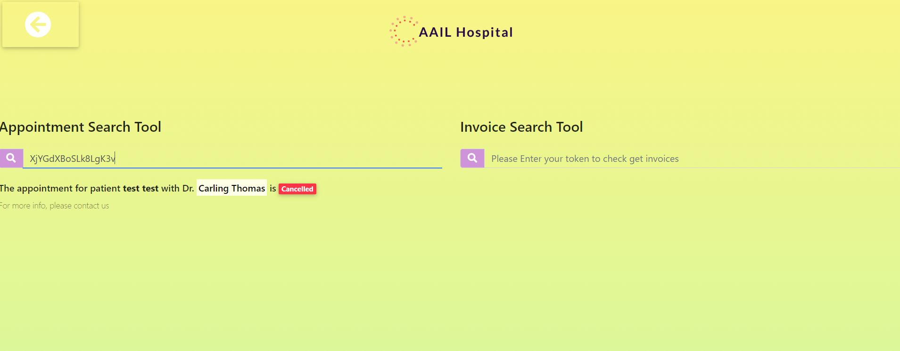
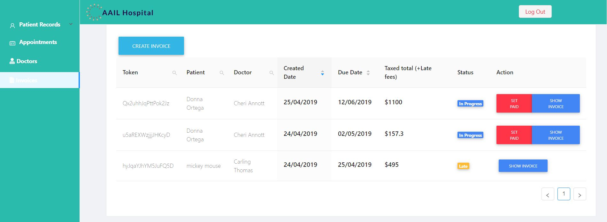
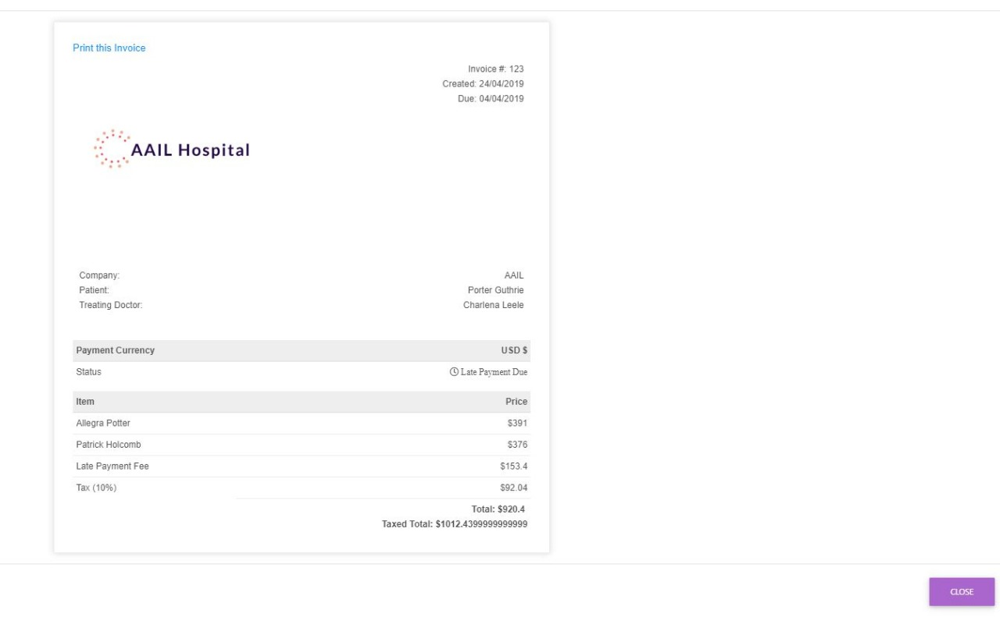

# Hospital Managment React.js System

# [Live Demo](https://aail.herokuapp.com/)

# Before Running!
  - Install Meteor https://www.meteor.com/install

```sh
$ curl https://install.meteor.com/ | sh
$ npm install -d
$ meteor //to run
```
  
# To run desktop version: 
```sh
$ npm run desktop --win --mac
```

# To use
For nurse login : 
*username* : *nurse*
*password* : *nurse*
 
Features
- Patient Frontend view that doesn't require login, uses a token given to the patient by a nurse/staff member to allow the patient to view appointment status or view/print invoice.
<p align="center">
  
</p>

<p align="center">
  
</p>

- Staff/Nurse view that allows for patient record CRUD, appointment creation and managment and generates a token for every appointment to be given to the patient in question


<p align="center">
  
</p>
- Invoice creation with automatic late fee detection and calculation that automatically adds a 1% fee to every late day, and generates an invoice 

<p align="center">
  
</p>
